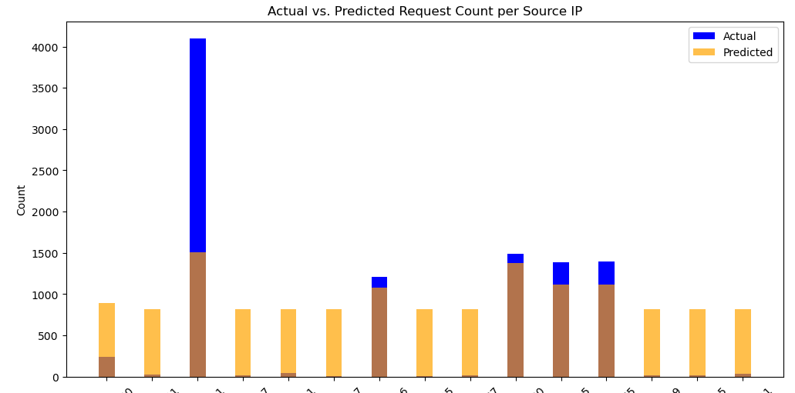
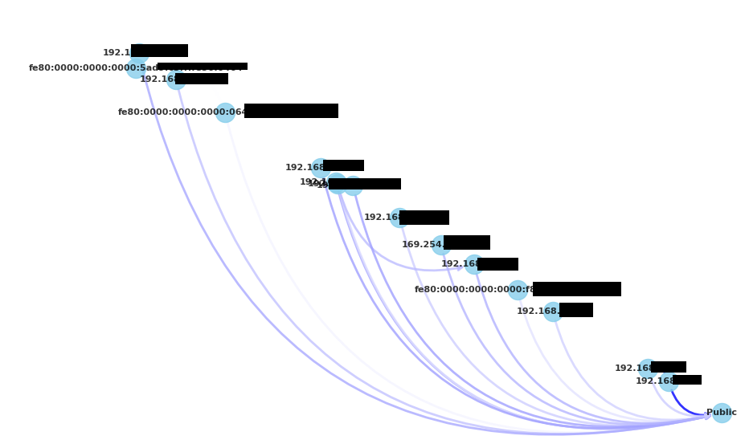

# Pyspark

PISCES scripts to access elasticsearch and build graphs and other machine learning models using pyspark

# Requirements

- Docker

# Usage

1. After installing docker, go to the directory of the repository:
`docker compose up`

2. This will download and bootup the jupyter environment. Once everything is loaded you should see a text like:
`http://127.0.0.1:8888/lab?token=bd75ce9c2eea0b9`

3. Enter the URL on your browser and you should be able to see the Jupyter notebook. 

4. Navigate to the directory where the example-scripts are (through your OS - not Jupyter) and edit the .env file. Add your own variables.

5. Back on Jupyter, on the left hand side, open the example-script (by double clicking). Double click on rfmodel.ipynb

6. Add an additional to specify the customer's network that you want to build the RF model for:

```
{
  "term": {
    "clientid": "specifymunicipality"
  }
},
```

6. Hit Run and the script should run.

# RF Model

This is an example of a random forest model that takes the past days of DNS traffic and attempts to predict for each IP whether the behavior matches the prediction. It adjust the predictions based on the fraction of the day too.

Depending on the amount of records, it can take a while to compute. Some things that can optimize:
- Always use `_source` in the es_query and the list of fields as shown in the example code as it restricts elasticsearch from returning only specific fields that you need (saving bandwidth).
- Further restrict the data use `term` to specific data that you need.
- The default script is missing a customer specification (`clientid`). You will need to specify that otherwise the results will be meaningless.
- It is not uncommon for the script to take ~10 minutes to complete depending on the data needed to be acquire from ES and the load on ES.

Example output:



Blue means above predicted requests. A t-test is also conducted to demonstrate whether the change is statistically significant, although the visual is often sufficient.

# Graphframes and NetworkX

You can build graphs using the data to understand communications within the network. This is an example script that helps you with just that. Note: graphs with many nodes can be dramatically more expensive to make. Make sure to restrict for one customer (`clientid`). Even so, the script has been heavily modded to reduce the amount of nodes.

Example output:



Image is interactive and you can zoom in to see more details.

